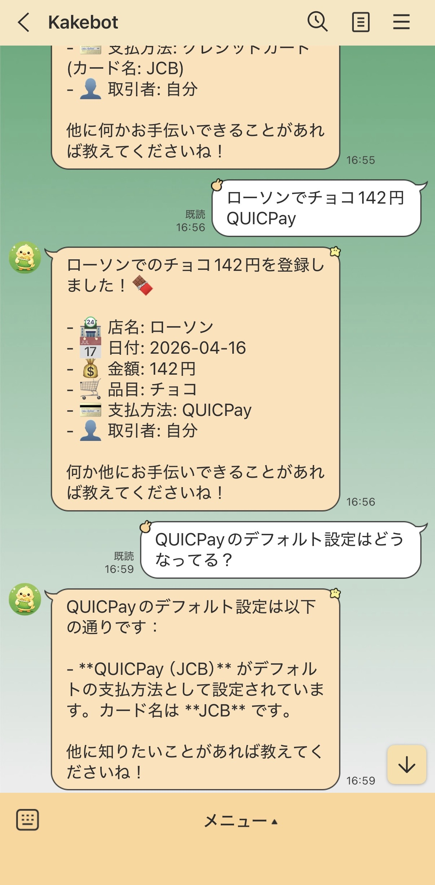
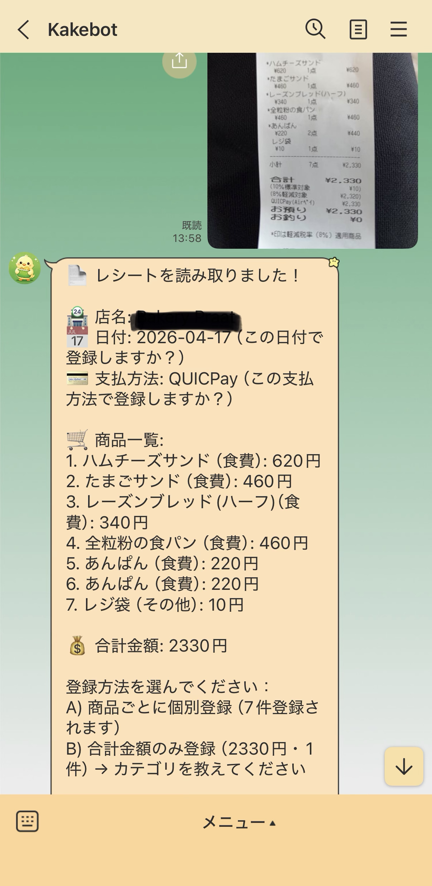
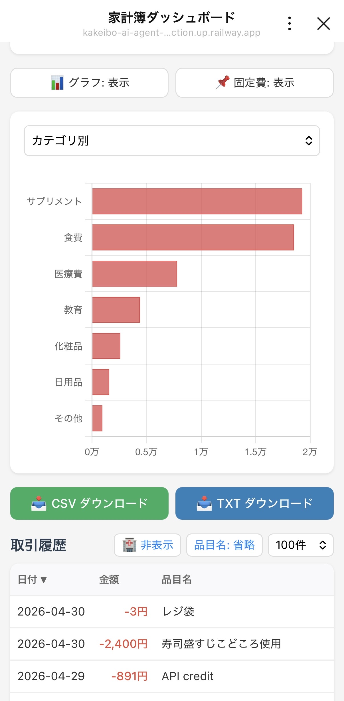

# 家計簿AIエージェント

LINE Bot ベースの家計簿AIエージェント。自然言語で話しかけるだけで入出金の記録・集計・予算管理ができます。

OpenAI Function Calling を活用し、ユーザーの意図を判定して適切な操作を実行するエージェントアーキテクチャを採用しています。

## デモ

### LINE Bot でのチャット操作


### レシートOCR


### ダッシュボード（LIFF）



## 主な機能

### 自然言語による入出金記録
「セブンで弁当500円」「給料25万入った」のように話しかけるだけで、日付・カテゴリ・支払方法を自動判定して記録します。修正や削除も自然言語で指示できます。

### レシートOCR
レシートの画像をLINEに送ると、GPT-4o の Vision API で店名・品目・金額を読み取り、確認フローを経て登録します。商品ごとの個別登録と合計金額での一括登録を選択できます。

### 多軸集計・月次比較
カテゴリ別・店別・品目別・支払方法別の集計、前月比較や任意の月との比較に対応。全ての集計はTool（関数）側で行い、LLMには計算させない設計です。

### 予算管理
カテゴリ別に月額予算を設定でき、取引登録時に自動で予算チェックが走ります。警告閾値を設定すると超過前に事前通知も可能です。

### 固定費管理
家賃・サブスク等の毎月の固定出金を登録し、「今月の固定費を計上して」で一括反映。口座振替の場合は土日祝の翌営業日調整も行います。

### ダッシュボード（LIFF）
LINE のリッチメニューからアクセスできるダッシュボードで、グラフ表示（カテゴリ別・店別・品目別・月別推移）、取引履歴のソート・フィルタ、CSV/TXTダウンロードが可能です。

### ファイル出力
チャットからCSV・TXT形式で集計結果やレポートを出力できます。ダッシュボードからのダウンロードにも対応。

## アーキテクチャ

```
LINE Bot (Messaging API)
    │
    ▼
FastAPI (api/main.py)
    │
    ├─ Webhook (api/line/webhook.py)
    │      ├─ テキスト → Agent
    │      └─ 画像 → Vision API (OCR) → Agent
    │
    ├─ Agent (api/agent/core.py)
    │      ├─ システムプロンプト構築
    │      ├─ OpenAI Chat Completions API (Function Calling)
    │      ├─ Tool 実行ループ (最大5回)
    │      ├─ デフォルト値補完 (日付・支払方法・カード)
    │      └─ 後処理 (予算チェック等)
    │
    ├─ Tool 定義 (api/agent/tools.py)
    │      └─ 25個の Tool（JSON Schema）
    │
    ├─ CRUD (api/db/crud.py)
    │      └─ PostgreSQL 操作
    │
    ├─ LIFF ページ (api/liff/)
    │      ├─ dashboard.html (Chart.js)
    │      └─ guide.html
    │
    └─ ユーティリティ
           ├─ file_export.py
           ├─ business_day.py (祝日判定: jpholiday)
           └─ logger.py

Streamlit UI (ui/app.py) ── 開発・検証用

MLflow (mlflow/) ── Tool選択精度の評価追跡

PostgreSQL ── 取引・予算・固定費・設定・支払方法・カード
```

## 技術スタック

| レイヤー | 技術 |
|---|---|
| LLM | OpenAI GPT-4o-mini（チャット）/ GPT-4o（Vision・OCR） |
| バックエンド | FastAPI, Python 3.12 |
| データベース | PostgreSQL 16 |
| フロントエンド | LINE Bot (Messaging API), LIFF, Chart.js |
| 開発用UI | Streamlit |
| 評価 | MLflow |
| インフラ | Docker Compose（ローカル）, Railway（本番） |
| その他 | jpholiday（祝日判定）, statsmodels（Wilson信頼区間） |

## セットアップ

### 前提条件

- Docker / Docker Compose
- OpenAI API キー
- LINE Developers アカウント（LINE Bot / LIFF 設定済み）

### 手順

```bash
# リポジトリをクローン
git clone https://github.com/your-username/kakeibo-ai-agent.git
cd kakeibo-ai-agent

# 環境変数を設定
cp .env.example .env
# .env を編集し、OpenAI API キーと LINE Bot の設定を記入

# 起動
docker compose up -d

# DB初期化 & デモデータ投入
docker compose exec api python -m scripts.seed
docker compose exec api python -m scripts.generate_dummy_data
```

### アクセス

| サービス | URL |
|---|---|
| API | http://localhost:8000 |
| Streamlit UI | http://localhost:8501 |
| MLflow | http://localhost:5001 |

## プロジェクト構成

```
kakeibo-ai-agent/
├── api/
│   ├── agent/
│   │   ├── core.py          # Agent パイプライン
│   │   └── tools.py         # Function Calling Tool 定義
│   ├── db/
│   │   ├── connection.py    # DB 接続管理
│   │   └── crud.py          # CRUD 操作
│   ├── evaluation/
│   │   └── evaluate.py      # Tool 選択精度評価
│   ├── liff/
│   │   ├── dashboard.html   # ダッシュボード (Chart.js)
│   │   └── guide.html       # 使い方ガイド
│   ├── line/
│   │   └── webhook.py       # LINE Webhook / OCR
│   ├── models/
│   │   └── schemas.py       # Pydantic スキーマ
│   ├── utils/
│   │   ├── business_day.py  # 営業日判定
│   │   ├── file_export.py   # ファイル出力
│   │   └── logger.py        # ロガー
│   └── main.py              # FastAPI エントリポイント
├── ui/
│   └── app.py               # Streamlit（開発用）
├── mlflow/                   # MLflow 設定
├── scripts/
│   ├── seed.py              # DB 初期化
│   └── generate_dummy_data.py  # ダミーデータ生成
├── data/                     # 評価データ等
├── docker-compose.yml
└── .env.example
```

## 設計上の工夫

### LLM に計算させない
集計・予算チェック等の数値計算は全てSQL / Python のTool側で行い、LLMには結果の解釈と自然言語生成のみを担当させています。LLMによる計算は信頼性が低いため、ツール側に責務を分離しました。

### デフォルト値の自動補完
日付・支払方法・クレジットカードの3つは、LLMが省略した場合にコード側（`_complement_defaults`）で補完します。LLMに毎回正確に出力させるよりも、プログラムで確実に処理する方が信頼性が高いためです。

### 予算チェックの自動実行
取引登録後に `_post_process` で予算チェックを自動実行し、警告・超過があればLLMの応答に追加情報として注入します。ユーザーが明示的に確認しなくても、必要な警告が届く設計です。

### 削除・更新の2ステップ確認
取引の削除・更新は必ず `get_transactions` で候補を表示 → ユーザー承認 → 実行の流れを踏みます。システムプロンプトでの指示に加え、プログラム的にもガードを設けています。

### Tool命名規則によるUI連携
参照系Toolは `get_` / `check_` 、更新系Toolはそれ以外のプレフィックスという命名規則を設け、UI側でDB更新後の再描画判定に利用しています。

## 評価

Phase 4 でTool選択精度を評価しました。62件のテストケースに対してMLflowで追跡しています。

| 指標 | 値 |
|---|---|
| Tool選択 正解率 | 89.8% |
| 引数生成 正解率 | 82.1% |
| 95% Wilson信頼区間（Tool選択） | [80.2%, 95.0%] |

## ライセンス

このプロジェクトは個人のポートフォリオ作品です。
